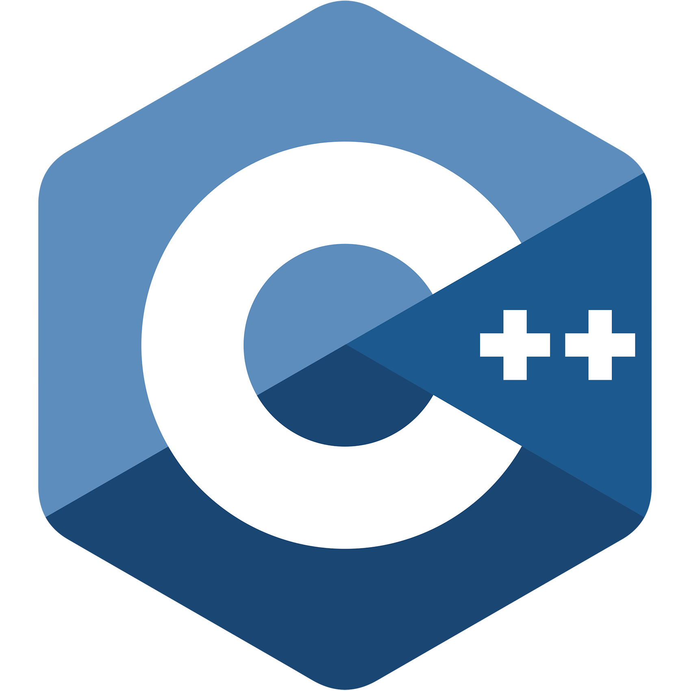
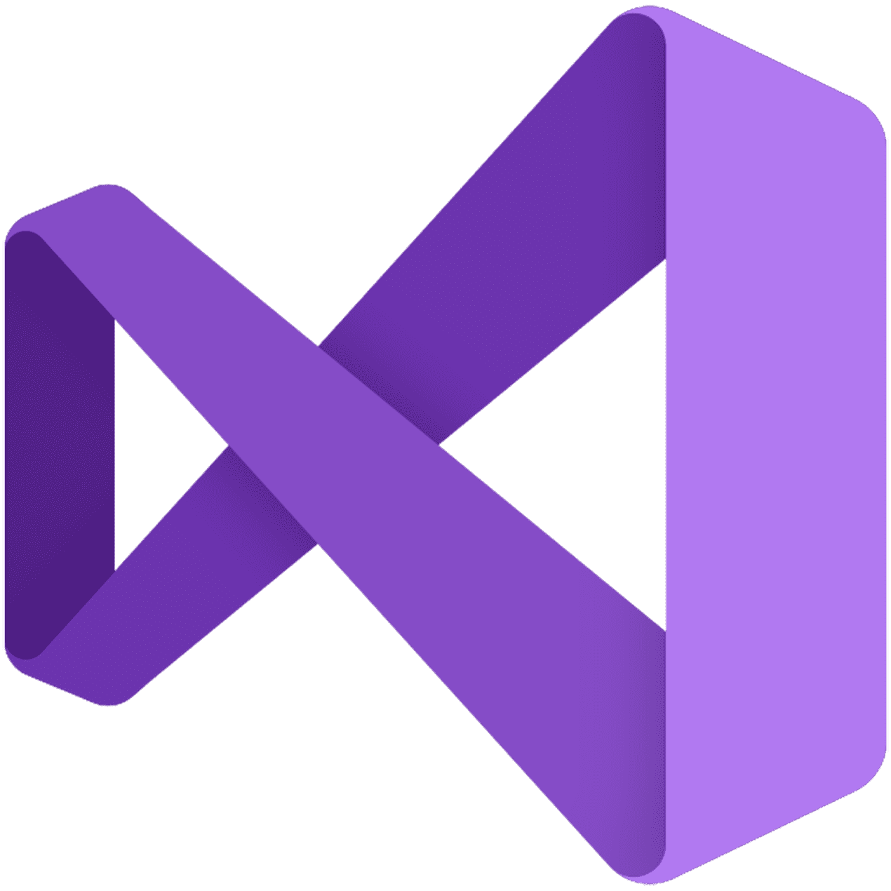
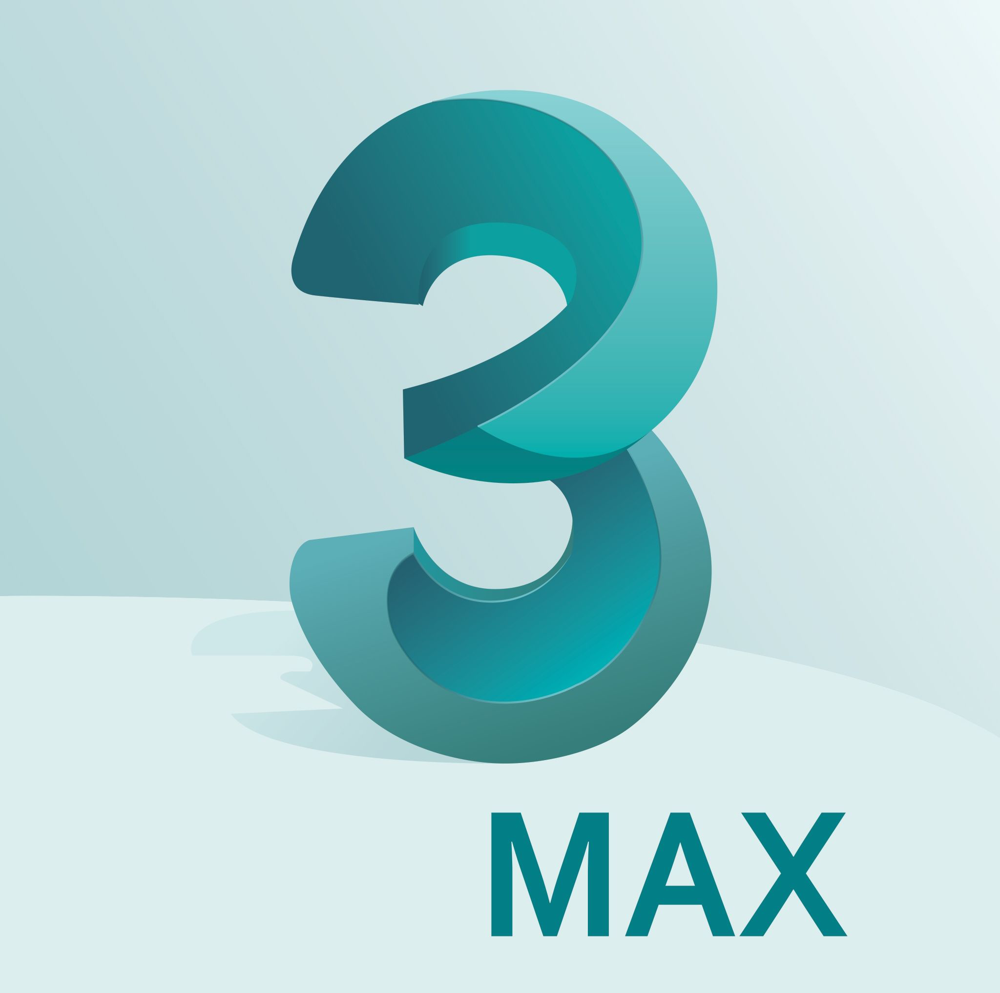

### Hi there, I am Jason Skillman - @Jason-Skillman
## 🎮 Game Programmer, Designer, Mobile Developer

Welcome to my profile page 👏

- 🔭 I’m currently working on an escape room expirence game professionally.
- 🌱 I’m currently learning about custom shaders and shader graph for Unity.
- 👯 I’m looking to collaborate on any Unity open source project.
- 🤔 I’m looking for help with advanced shaders with HLSL for Unity URP/HDRP.
- 💬 Ask me about my favorite game and why. 🌌🚀
- 📫 How to reach me: https://www.linkedin.com/in/jason-skillman/
- 😄 Pronouns: He/Him
- ⚡ Fun fact: The UDK was my first game engine and taught me a lot about assets and project work flow.

### Social Media / Contact Me
[][MyWebsite]
[][LinkedIn]
[][Itch.io]

### Favorite Launguages
[][MyWebsite]
[][MyWebsite]
[][MyWebsite]
[][MyWebsite]
[][MyWebsite]
[][MyWebsite]
[][MyWebsite]
[][MyWebsite]

### Favorite Tools
[][MyWebsite]
[][MyWebsite]
[][MyWebsite]
[][MyWebsite]
[][MyWebsite]
[][MyWebsite]
[][MyWebsite]
[][MyWebsite]
[][MyWebsite]
[][MyWebsite]
[][MyWebsite]
[][MyWebsite]
[][MyWebsite]
[][MyWebsite]

 

<!-- Definitions -->
[MyWebsite]: https://jasonskillman.wixsite.com/website
[LinkedIn]: https://www.linkedin.com/in/jason-skillman/
[Itch.io]: https://jason_skillman.itch.io/
<!-- [GitLab]: https://gitlab.com/Jason-Skillman -->

<!--
**Jason-Skillman/Jason-Skillman** is a ✨ _special_ ✨ repository because its `README.md` (this file) appears on your GitHub profile.

Here are some ideas to get you started:

- 🔭 I’m currently working on ...
- 🌱 I’m currently learning ...
- 👯 I’m looking to collaborate on ...
- 🤔 I’m looking for help with ...
- 💬 Ask me about ...
- 📫 How to reach me: ...
- 😄 Pronouns: ...
- ⚡ Fun fact: ...
-->
