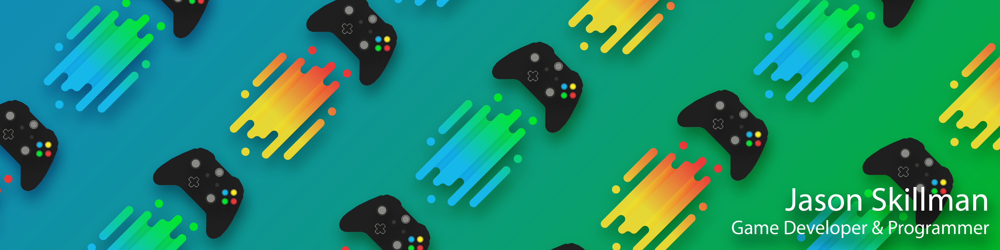

### Hi there, I am Jason Skillman - @Jason-Skillman
## 🎮 Game Programmer | 🕶️ VR Developer | 🖌️ Technical Artest

Welcome to my profile page 👏

- 🔭 I’m currently working on a free roam full body VR experience at our LBE location. (The Edge VR)
- 🌱 I’m currently furthering my education in Unreal C++ and compute shaders.
- 💬 Ask me about my favorite game and why. 🚀
- 📫 How to reach me: https://www.linkedin.com/in/jason-skillman/
- ⚡ Fun fact: The UDK was my first game engine and I have been programming since 2014.

### Favorite Launguages

 

### Favorite Tools

 

### Social Media / Contact Me

 

<!--
[][MyWebsite]
[][LinkedIn]
[][Itch.io]
-->

##  Unity Packages
I work on tools and packages for Unity. Check them out below.

 

## 📊 Stats

<!-- https://github.com/anuraghazra/github-readme-stats -->

<!-- Definitions -->
[MyWebsite]: https://jasonskillman.wixsite.com/website
[LinkedIn]: https://www.linkedin.com/in/jason-skillman/
[Itch.io]: https://jason_skillman.itch.io/
<!-- [GitLab]: https://gitlab.com/Jason-Skillman -->

<!-- Old themes

-->

<!--
**Jason-Skillman/Jason-Skillman** is a ✨ _special_ ✨ repository because its `README.md` (this file) appears on your GitHub profile.

Here are some ideas to get you started:

- 🔭 I’m currently working on ...
- 🌱 I’m currently learning ...
- 👯 I’m looking to collaborate on ...
- 🤔 I’m looking for help with ...
- 💬 Ask me about ...
- 📫 How to reach me: ...
- 😄 Pronouns: ...
- ⚡ Fun fact: ...
-->
